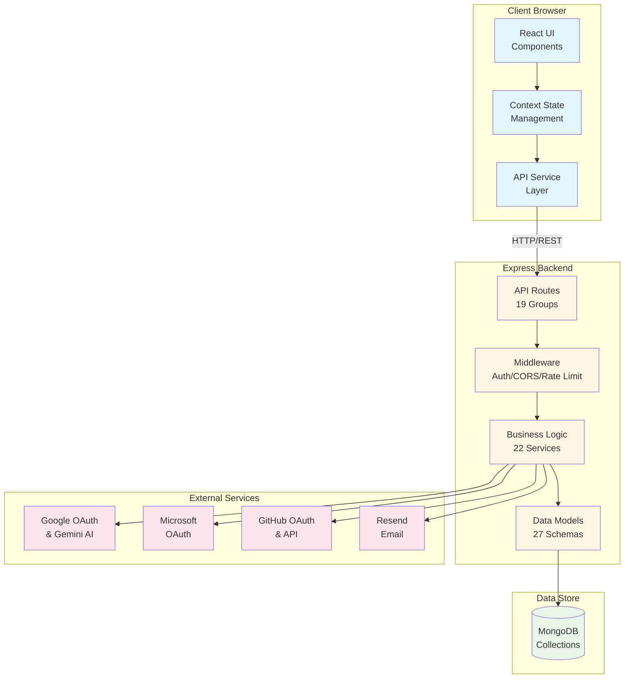
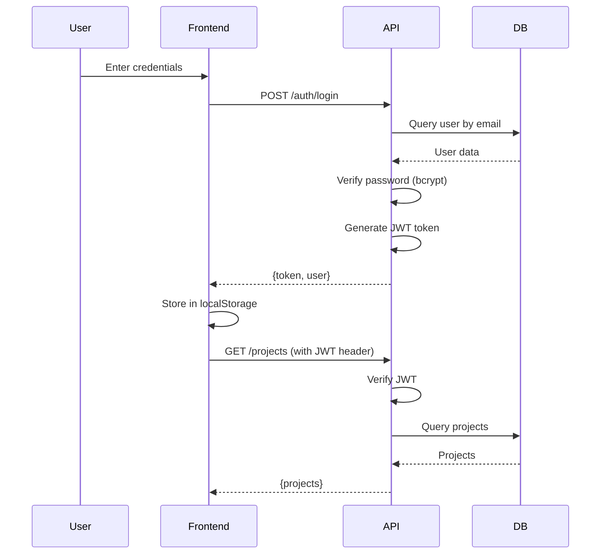
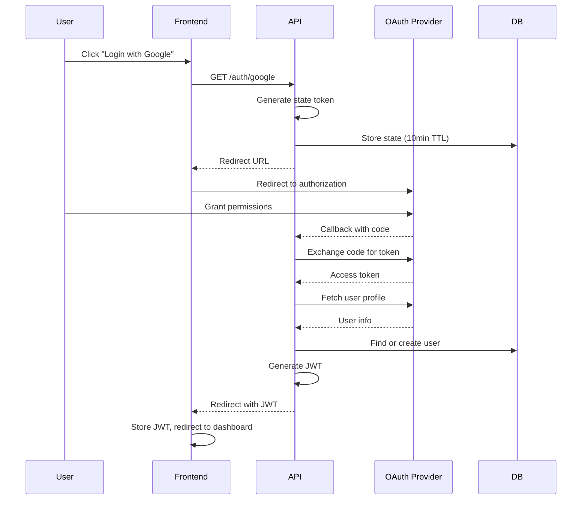

# System Architecture

Comprehensive overview of Infinia Products' technical architecture.

## Architecture Overview

Infinia Products is built as a modern three-tier web application with clear separation of concerns:

```
┌─────────────────────────────────────────────────────────────┐
│                         CLIENT LAYER                         │
│  ┌────────────────────────────────────────────────────────┐ │
│  │          React 19 + TypeScript + Vite 6               │ │
│  │  - 62 Components - Context State - Service Layer      │ │
│  └────────────────────────────────────────────────────────┘ │
└────────────────────────┬────────────────────────────────────┘
                        │ HTTP/REST (JSON)
                        │ JWT Authentication
                        ▼
┌─────────────────────────────────────────────────────────────┐
│                       API LAYER                              │
│  ┌────────────────────────────────────────────────────────┐ │
│  │         Express 4 + Node.js 18+ + TypeScript           │ │
│  │  Routes → Services → Models (19 route groups)          │ │
│  │  - JWT Auth - OAuth 2.0 - Rate Limiting - CORS        │ │
│  └────────────────────────────────────────────────────────┘ │
└────────────────────────┬────────────────────────────────────┘
                        │ Mongoose ODM
                        ▼
┌─────────────────────────────────────────────────────────────┐
│                      DATA LAYER                              │
│  ┌────────────────────────────────────────────────────────┐ │
│  │              MongoDB 7.0 (27+ Collections)             │ │
│  │  Multi-tenant - Indexed - ACID Transactions            │ │
│  └────────────────────────────────────────────────────────┘ │
└─────────────────────────────────────────────────────────────┘
```

### External Integrations

```
API Layer also connects to:
├── OAuth Providers (Google, Microsoft, GitHub)
├── AI Services (Google Gemini, Anthropic Claude)
├── Email Service (Resend)
└── GitHub API (for PRD sync)
```

## High-Level Component Diagram



## Frontend Architecture

### Technology Stack

| Layer | Technology | Purpose |
|-------|-----------|---------|
| **Framework** | React 19 | UI component library |
| **Language** | TypeScript | Type safety |
| **Build Tool** | Vite 6 | Fast dev server & bundling |
| **Styling** | Tailwind CSS | Utility-first CSS |
| **Icons** | Lucide React | Icon library |
| **Routing** | React Router | Client-side routing (in App.tsx) |
| **State** | React Context | Global state management |
| **AI** | Claude API, Gemini API | AI-powered features |

### Component Hierarchy

```
App.tsx (Main Router & Auth)
├── Providers (Theme, Error, Toast, Config, ProjectData)
│   └── Layout
│       ├── Sidebar (Navigation & Search)
│       │   ├── Project List
│       │   ├── Global Search
│       │   └── Organization Switcher
│       │
│       ├── Main Content Area
│       │   ├── Home (Dashboard)
│       │   │   ├── Bento Grid Widgets
│       │   │   ├── My Tasks Widget
│       │   │   └── Copilot CTA
│       │   │
│       │   └── ProjectView (Project Container)
│       │       ├── Header (Tab Navigation)
│       │       └── Tab Content
│       │           ├── Overview (Dashboard)
│       │           ├── Documents (PRDView)
│       │           ├── Sprints (SprintsView)
│       │           ├── Tasks (ListView)
│       │           ├── Boards (KanbanBoard)
│       │           ├── Timeline (TimelineView)
│       │           ├── Teams (TeamsView)
│       │           └── Files (Coming Soon)
│       │
│       └── Modals (Global)
│           ├── CopilotModal
│           ├── TaskDetailModal
│           ├── CreateTaskModal
│           ├── ProductGeneratorModal
│           ├── InviteUserModal
│           └── [30+ other modals]
│
└── Authentication Views
    ├── LoginView
    ├── ForgotPasswordView
    ├── ResetPasswordView
    ├── OAuthCallback
    └── InviteAcceptPage
```

### State Management Pattern

**Context Providers** (5 major contexts):

1. **ProjectDataContext** - Central data hub
   - Stores: projects, tasks, sprints, teams, users, organizations
   - Actions: add, update, delete for all entities
   - Computed: filtered/derived data
   - 📍 File: `/context/ProjectDataContext.tsx`

2. **ThemeContext** - UI theme
   - Stores: light/dark mode preference
   - Persists to localStorage
   - 📍 File: `/context/ThemeContext.tsx`

3. **ConfigContext** - App configuration
   - Stores: task types, priorities, statuses, nav items
   - 📍 File: `/context/ConfigContext.tsx`

4. **ErrorContext** - Error handling
   - Global error boundaries
   - 📍 File: `/context/ErrorContext.tsx`

5. **NotificationContext** - Real-time notifications
   - In-app notification system
   - 📍 File: `/context/NotificationContext.tsx`

### Data Flow Pattern

```
User Action (Component)
    ↓
Context Action (e.g., addTask)
    ↓
API Service Call (lib/api.ts or services/*.service.ts)
    ↓
HTTP Request to Backend
    ↓
Backend Response
    ↓
Update Context State (optimistic or on success)
    ↓
React Re-renders Components
```

**Example: Creating a Task**

```typescript
// 1. User clicks "Create Task" button in KanbanBoard
// 2. CreateTaskModal opens with form
// 3. User submits form
// 4. Component calls context action:
const { addTask } = useProjectData();
await addTask(taskData);

// 5. Context action calls API service:
const response = await api.createTask(taskData);

// 6. Backend processes and returns task with ID
// 7. Context updates state with new task
// 8. KanbanBoard re-renders showing new task
```

### Service Layer

Frontend services abstract API calls:

- **api.ts** - Primary API client with mappers
- **auth.service.ts** - Authentication operations
- **tasks.service.ts** - Task-specific operations
- **projects.service.ts** - Project operations
- **sprints.service.ts** - Sprint operations
- **teams.service.ts** - Team operations
- **users.service.ts** - User management
- **organizations.service.ts** - Organization operations
- **documents.service.ts** - Document/PRD operations
- **notifications.service.ts** - Notification handling
- **invites.service.ts** - Invitation management
- **storage.service.ts** - File upload/storage

📍 Location: `/services/` and `/lib/api.ts`

## Backend Architecture

### Technology Stack

| Layer | Technology | Purpose |
|-------|-----------|---------|
| **Framework** | Express 4 | Web server framework |
| **Language** | TypeScript | Type safety |
| **Runtime** | Node.js 18+ | Server runtime |
| **Database** | MongoDB 7.0 | NoSQL document database |
| **ODM** | Mongoose 9 | MongoDB object modeling |
| **Auth** | jsonwebtoken | JWT token generation |
| **OAuth** | passport-oauth2 | OAuth 2.0 flows |
| **Email** | Resend, Nodemailer | Email delivery |
| **Security** | Helmet, CORS | Security headers |
| **Validation** | Zod | Request validation |

### Backend Layers

#### 1. Routes Layer (`/routes`)

- **Purpose**: Define API endpoints and HTTP methods
- **Responsibility**: Request parsing, route to service
- **Count**: 19 route files
- **Pattern**: `/api/v1/<resource>`

**Example Routes**:
- `/api/v1/auth/*` - Authentication
- `/api/v1/projects/*` - Projects
- `/api/v1/tasks/*` - Tasks
- `/api/v1/sprints/*` - Sprints
- `/api/v1/organizations/*` - Organizations

📍 Location: `/backend/src/routes/`

#### 2. Middleware Layer (`/middleware`)

**Authentication Middleware** (`auth.middleware.ts`):
- `authMiddleware` - Optional auth (continues without user)
- `requireAuth` - Required auth (returns 401 if missing)
- Extracts JWT from `Authorization: Bearer <token>` header
- Validates token and loads user from database
- Attaches `AuthUser` object to `req.user`

**Error Handling Middleware** (`error.middleware.ts`):
- Global error handler
- Zod validation error formatting
- AppError custom error class
- Development vs production error details

**Security Middleware**:
- **Helmet**: Security headers
- **CORS**: Cross-origin resource sharing
- **Rate Limiting**: 100 requests per 15 minutes (configurable)
- **Body Parser**: JSON limit 10MB

📍 Location: `/backend/src/middleware/`

#### 3. Service Layer (`/services`)

- **Purpose**: Business logic implementation
- **Responsibility**: Data validation, complex operations, external API calls
- **Count**: 22 service files

**Key Services**:
- `auth.service.ts` - Registration, login, OAuth
- `users.service.ts` - User CRUD, filtering
- `projects.service.ts` - Project management, access control
- `tasks.service.ts` - Task operations, permissions
- `sprints.service.ts` - Sprint lifecycle
- `teams.service.ts` - Team management
- `organizations.service.ts` - Organization operations
- `notification.service.ts` - Notification generation
- `email.service.ts` - Email sending
- `githubSync.service.ts` - GitHub PRD sync

📍 Location: `/backend/src/services/`

#### 4. Model Layer (`/models`)

- **Purpose**: Database schema definitions
- **Technology**: Mongoose schemas
- **Count**: 27+ models
- **Pattern**: TypeScript interfaces + Mongoose schemas

**Core Models**:
- User, Organization, OrganizationMember
- Project, ProjectMember
- Task, Subtask, TaskLink
- Sprint, Team, TeamMember
- Comment, DocumentComment
- Notification, NotificationPreference
- Activity, Tag, Column
- GitHubIntegration, OAuthState

📍 Location: `/backend/src/models/index.ts`

### Request Flow

```
HTTP Request
    ↓
Express App
    ↓
Security Middleware (Helmet, CORS, Rate Limit)
    ↓
Body Parser (JSON)
    ↓
Route Handler
    ↓
Auth Middleware (if protected route)
    ├─ Extract JWT from header
    ├─ Verify JWT signature
    ├─ Load user from database
    └─ Attach to req.user
    ↓
Validation (Zod schema)
    ↓
Service Layer
    ├─ Business logic
    ├─ Database queries (via Mongoose)
    └─ External API calls (if needed)
    ↓
Response
    ├─ Success: { success: true, data: {...} }
    └─ Error: { success: false, error: "..." }
    ↓
Error Handler (if error thrown)
    └─ Format error response
    ↓
HTTP Response
```

### Database Architecture

See [Database Schema Documentation](database-schema.md) for complete details.

**Key Characteristics**:
- **Multi-Tenant**: Organization-scoped data isolation
- **Indexed**: Optimized queries with compound indexes
- **Relationships**: 1:1, 1:N, N:N via foreign keys
- **Transactions**: ACID compliance for critical operations
- **Schema Validation**: Mongoose schema validators

**Organization Hierarchy**:
```
Organization
├── Members (OrganizationMember)
│   └── Users
├── Projects
│   ├── Members (ProjectMember)
│   ├── Tasks
│   │   ├── Subtasks
│   │   ├── Comments
│   │   └── Links (dependencies)
│   ├── Sprints
│   └── Columns (Kanban)
└── Teams
    ├── Members (TeamMember)
    └── Projects (TeamProject)
```

## Authentication & Authorization

See [Authentication & Authorization Documentation](authentication-authorization.md) for complete details.

### JWT Authentication Flow



### OAuth 2.0 Flow



## Security Architecture

### Security Layers

1. **Network Layer**
   - HTTPS/TLS encryption (production)
   - CORS policy enforcement
   - Rate limiting per IP

2. **Application Layer**
   - JWT token authentication
   - Password hashing (bcrypt, 12 rounds)
   - Input validation (Zod schemas)
   - SQL injection protection (Mongoose ODM)
   - XSS protection (Helmet headers)

3. **Data Layer**
   - Organization-level isolation
   - Role-based access control
   - Encrypted sensitive data (GitHub tokens)
   - Database access controls

4. **OAuth Security**
   - State token CSRF protection
   - Token expiration (10 minutes)
   - Secure callback validation

### Multi-Tenancy & Data Isolation

**Strategy**: Organization-scoped filtering

Every resource (project, task, sprint, team) has an `organization_id` field:

```typescript
// All queries automatically filter by organization
const projects = await Project.find({ organization_id: user.organizationId });
```

**Access Control**:
- User must be OrganizationMember to access resources
- Project-level permissions via ProjectMember
- Role-based actions (owner, admin, member, viewer)

See [Multi-Tenancy Documentation](multi-tenancy.md) for details.

## Performance Optimizations

### Frontend Optimizations

1. **Code Splitting** - Lazy loading for routes (planned)
2. **Memoization** - `useMemo` for expensive computations
3. **Callbacks** - `useCallback` for stable function references
4. **Bundling** - Vite production optimization

### Backend Optimizations

1. **Database Indexes** - Compound indexes on frequently queried fields
2. **Connection Pooling** - MongoDB connection pooling
3. **Pagination** - All list endpoints support pagination
4. **Batch Loading** - Fix N+1 queries with batch operations
5. **Caching** - Planned for frequently accessed data

### Database Indexes

**Critical Indexes**:
```typescript
// Organizations
{ organization_id: 1, user_id: 1 } // Member lookups

// Projects
{ organization_id: 1 } // Org filtering
{ owner_id: 1 } // Owner lookups

// Tasks
{ project_id: 1, status: 1 } // Kanban queries
{ project_id: 1, sprint_id: 1 } // Sprint queries
{ assignee_id: 1, status: 1 } // My tasks queries
```

## Scalability Considerations

### Current Architecture

- **Vertical Scaling**: Single Express server
- **Database**: MongoDB Atlas with auto-scaling
- **Session Storage**: Stateless JWT (no session server)

### Future Scalability (Planned)

1. **Horizontal Scaling**
   - Load balancer (AWS ALB, Nginx)
   - Multiple Express instances
   - Stateless design enables easy scaling

2. **Caching Layer**
   - Redis for session caching
   - Cache frequently accessed data
   - Reduce database load

3. **CDN**
   - Static asset delivery
   - Frontend bundle caching

4. **Database Optimization**
   - Read replicas for read-heavy workloads
   - Sharding by organization_id

## Deployment Architecture

```
┌─────────────────────────────────────────────┐
│           CDN (CloudFront)                  │
│        Static Assets & Frontend             │
└────────────────┬────────────────────────────┘
                 │
┌────────────────▼────────────────────────────┐
│      Load Balancer (ALB)                    │
│        SSL Termination                      │
└────┬────────────────────────────────────┬───┘
     │                                     │
┌────▼─────────┐               ┌──────────▼───┐
│  Express API │               │  Express API  │
│  Instance 1  │               │  Instance 2   │
└────┬─────────┘               └──────────┬────┘
     │                                     │
     └──────────────┬──────────────────────┘
                    │
         ┌──────────▼──────────┐
         │   MongoDB Atlas      │
         │   (3-node replica)   │
         └─────────────────────┘
```

See [Deployment Documentation](../deployment/production-deployment.md) for details.

## Technology Decisions

### Why React?
- Component-based architecture
- Large ecosystem and community
- Excellent TypeScript support
- Fast rendering with virtual DOM

### Why Express?
- Lightweight and flexible
- Huge middleware ecosystem
- Easy to understand and maintain
- Excellent TypeScript support

### Why MongoDB?
- Flexible schema for evolving product
- Excellent horizontal scalability
- Native JSON support
- Strong aggregation framework

### Why JWT?
- Stateless authentication
- Easy to scale horizontally
- Mobile-friendly
- No session storage required

### Why TypeScript?
- Type safety reduces bugs
- Better developer experience (autocomplete)
- Self-documenting code
- Easier refactoring

## File Structure

```
infinia-products/
├── components/          # 62 React components
├── context/            # 5 context providers
├── services/           # 11 frontend services
├── lib/                # Utilities (api.ts, mappers.ts, httpClient.ts)
├── types.ts            # Frontend type definitions
├── constants.ts        # Mock data and constants
├── App.tsx             # Main application & routing
├── index.tsx           # React entry point
├── vite.config.ts      # Vite configuration
├── tailwind.config.js  # Tailwind CSS config
│
└── backend/
    └── src/
        ├── index.ts         # Express server entry
        ├── config/          # Environment config
        ├── lib/             # MongoDB client, email setup
        ├── middleware/      # Auth, error handling
        ├── models/          # 27 Mongoose schemas
        ├── routes/          # 19 API route files
        ├── services/        # 22 business logic services
        ├── scripts/         # DB seed/migration scripts
        └── utils/           # Error classes, helpers
```

## Development Workflow

```
Developer writes code
    ↓
Git commit to feature branch
    ↓
Push to GitHub
    ↓
CI/CD Pipeline (planned)
    ├─ Run linting (ESLint)
    ├─ Run tests (Jest/Vitest)
    ├─ Build frontend & backend
    └─ Deploy to staging
    ↓
QA Testing on staging
    ↓
Merge to main branch
    ↓
Deploy to production
```

## Monitoring & Observability (Planned)

**Logging**:
- Structured JSON logs
- Log levels (error, warn, info, debug)
- Request/response logging

**Metrics**:
- API response times
- Database query performance
- Error rates
- Active users

**Health Checks**:
- `/api/v1/health` - Basic health
- `/api/v1/health/ready` - Readiness probe
- `/api/v1/health/live` - Liveness probe

## Next Steps

- **Database Schema**: See [Database Schema](database-schema.md)
- **Authentication**: See [Authentication & Authorization](authentication-authorization.md)
- **Multi-Tenancy**: See [Multi-Tenancy](multi-tenancy.md)
- **Data Flow**: See [Data Flow](data-flow.md)
- **API Reference**: See [API Documentation](../api/README.md)
- **Deployment**: See [Deployment Guide](../deployment/production-deployment.md)

---

**Architecture Version**: 1.0.0
**Last Updated**: 2026-02-05

This architecture supports the current feature set and is designed to scale to thousands of organizations and millions of tasks.
